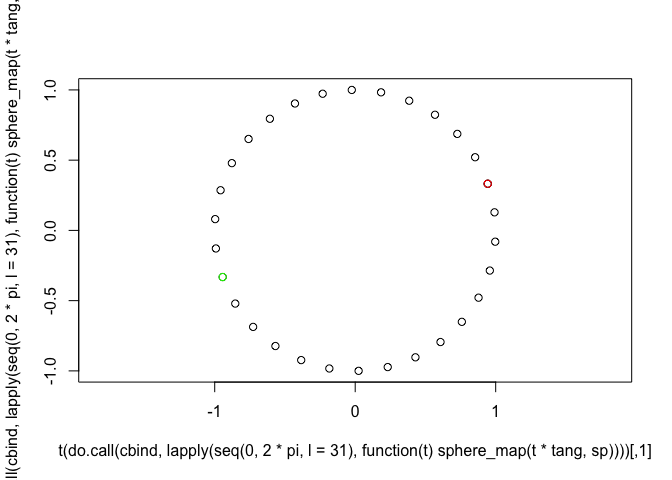

<!-- README.md is generated from README.Rmd. Please edit that file -->

# diffgeo

<!-- badges: start -->
<!-- badges: end -->

The `diffgeo` R package provides functions to work with six common
manifolds:

- Euclidean arrays
- Spheres (in $n$ dimensions)
- Rotation matrices (also called special orthogonal manifolds $SO(n)$)
- Stiefel manifold (matrices with orthogonal columns)
- Grassmann manifold (matrices with orthogonal columns but they are only
  considered different if they span separate spaces)
- Symmetric positive definite (SPD) matrices (symmetric matrices with
  positive eigenvalues)

## Installation

You can install `diffgeo` from
[Github](https://github.com/const-ae/diffgeo) with:

``` r
devtools::install_github("const-ae/diffgeo")
```

## Principles

For each manifold, `diffgeo` provides:

- Random points
- Random tangents
- Exponential map (a way to go along the manifold from one point to
  another)
- Logarithm (the inverse exponential map, that is a way calculate the
  direction between points on the manifold)

## Examples

To demonstrate the functionality of the package, I will show the
functions for the rotation matrices. All functions work analoguously for
the other manifolds.

``` r
library(diffgeo)
set.seed(1)
```

To begin, I create a random rotation matrix in 2D

``` r
rotation <- rotation_random_point(2)
```

We can visualize it’s effect on a random set of points

``` r
points <- rbind(rnorm(n = 20), rnorm(20))
rotated_points <- rotation %*% points
plot(t(points), pch = 16, col = "black", asp = 1, xlim = c(-3, 3), ylim = c(-2, 2))
points(t(rotated_points), pch = 16, col = "red")
segments(points[1,], points[2,], rotated_points[1,], rotated_points[2,])
```


We can also create high-dimensional rotations and check the formal
conditions for the rotation manifold

``` r
rotation2 <- rotation_random_point(5)
# Determinant is 1
Matrix::det(rotation2)
#> [1] 1
# All columns are orthogonal
round(t(rotation2) %*% rotation2, 3)
#>      [,1] [,2] [,3] [,4] [,5]
#> [1,]    1    0    0    0    0
#> [2,]    0    1    0    0    0
#> [3,]    0    0    1    0    0
#> [4,]    0    0    0    1    0
#> [5,]    0    0    0    0    1
```

An important concept in differential geometry are geodesics, i.e. are
lines on the manifold. To find the line that connects two rotations we
use the `rotation_log` function. These directions are from the tangent
space of the manifold. The tangent space of the rotation manifold is the
set of skew-symmetric matrices.

``` r
rotation3 <- rotation_random_point(5)
direction <- rotation_log(base_point = rotation2, target_point = rotation3)
round(direction, 3)
#>        [,1]   [,2]   [,3]   [,4]   [,5]
#> [1,]  0.000 -0.483 -0.749  1.063  1.019
#> [2,]  0.483  0.000  1.771  0.734 -0.333
#> [3,]  0.749 -1.771  0.000 -1.685 -0.925
#> [4,] -1.063 -0.734  1.685  0.000  1.083
#> [5,] -1.019  0.333  0.925 -1.083  0.000
```

We can also reverse the operation and go from a base-point in the
direction of a tangent vector (“exponential map”). If we do this using
the `direction` we will land exactly at `rotation3` again.

``` r
rotation3
#>            [,1]       [,2]       [,3]       [,4]       [,5]
#> [1,]  0.8461783 -0.2831550 -0.2681835  0.3369755  0.1353906
#> [2,] -0.1266562 -0.7590676 -0.3047431 -0.4071623 -0.3861671
#> [3,] -0.4350263 -0.5098987  0.1398897  0.6238921  0.3767557
#> [4,]  0.1644277 -0.2244352  0.3886541 -0.5630449  0.6741816
#> [5,] -0.2272798  0.1824053 -0.8152227 -0.1200224  0.4858793
rotation_map(v = direction, base_point = rotation2)
#>            [,1]       [,2]       [,3]       [,4]       [,5]
#> [1,]  0.8461783 -0.2831550 -0.2681835  0.3369755  0.1353906
#> [2,] -0.1266562 -0.7590676 -0.3047431 -0.4071623 -0.3861671
#> [3,] -0.4350263 -0.5098987  0.1398897  0.6238921  0.3767557
#> [4,]  0.1644277 -0.2244352  0.3886541 -0.5630449  0.6741816
#> [5,] -0.2272798  0.1824053 -0.8152227 -0.1200224  0.4858793
```

Lastly, it is important to understand that the Sphere, the Grassmann,
the Stiefel, and the Rotation manifold have a non-infinite injectivity
radius. The injectivity radius is furthest we can go along a manifold
and still guarantee that $\log(p, \exp_p(v))$ returns the original
tangent vector $v$. The concept is clearest for a 1-Sphere (aka a
circle): if we go further than 180° ($\pi$ radians), we end up at a
point for which there exist a shorter path to the starting point than
the original direction.

``` r
# Create a random vector with two elements on a circle
sp <- sphere_random_point(1)
# Make a tangent vector with norm 1
tang <- sphere_random_tangent(sp)
tang <- tang / sqrt(sum(tang^2))

# Plot different step lengths along the direction and 
# highlight the starting point in red and the point at the injectivity radius in green
plot(t(do.call(cbind, lapply(seq(0, 2 * pi, l = 31), \(t) sphere_map(t * tang, sp)))), asp = 1)
points(t(sp), col = "red")
points(t(sphere_map(sphere_injectivity_radius() * tang, sp)), col = "green")
```



# Alternatives

This package is heavily inspired and builds on the
[Manifolds](https://juliamanifolds.github.io/Manifolds.jl/latest/index.html)
and [Manopt.jl](https://manoptjl.org/stable/) packages developed by
Ronny Bergmann et al.. The Manopt.jl package in turn is inspired by the
[Manopt](https://www.manopt.org/) toolbox for Matlab.
